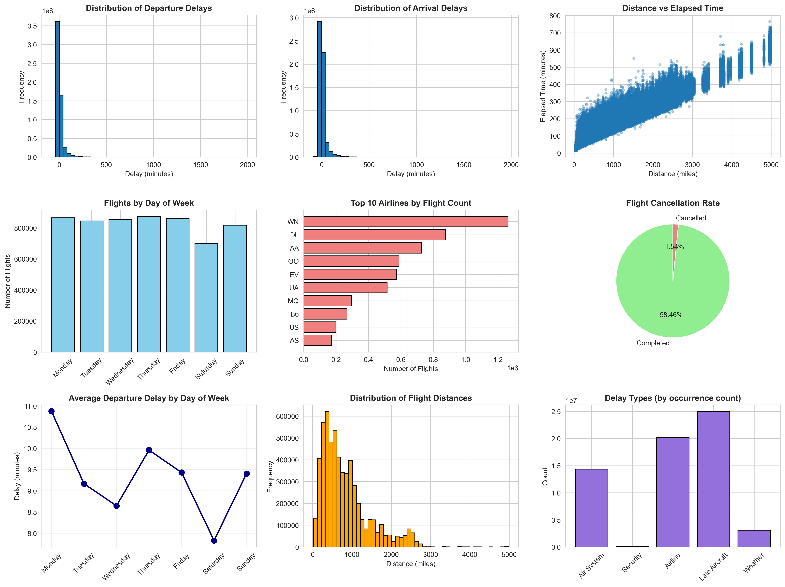
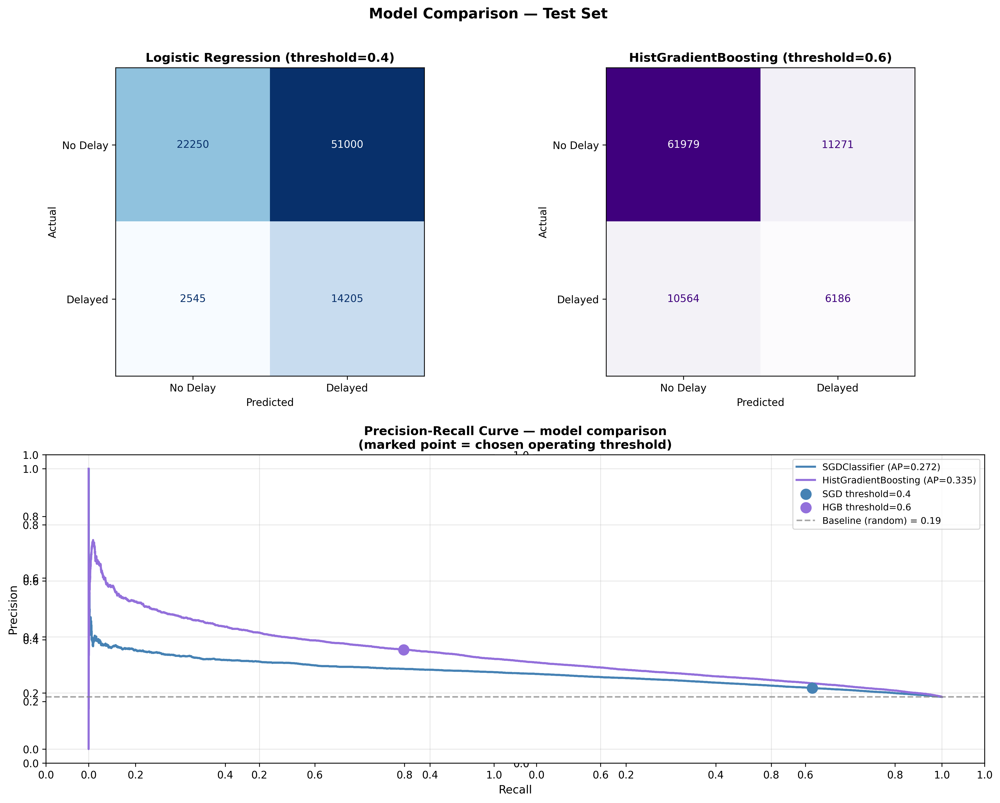
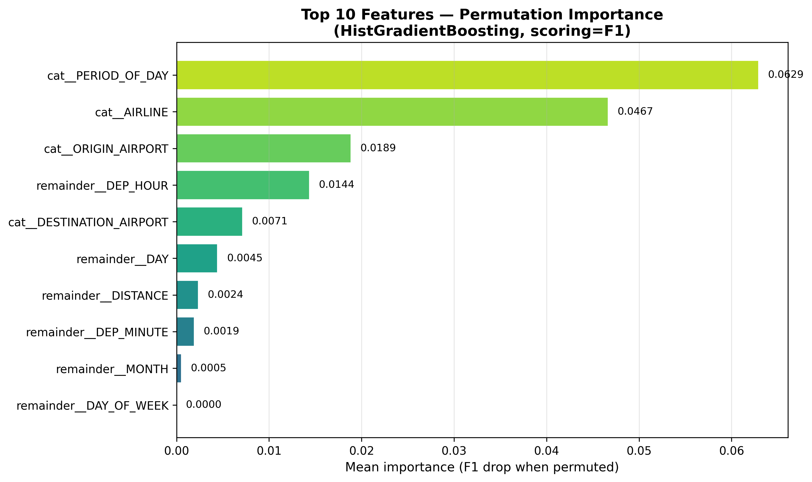
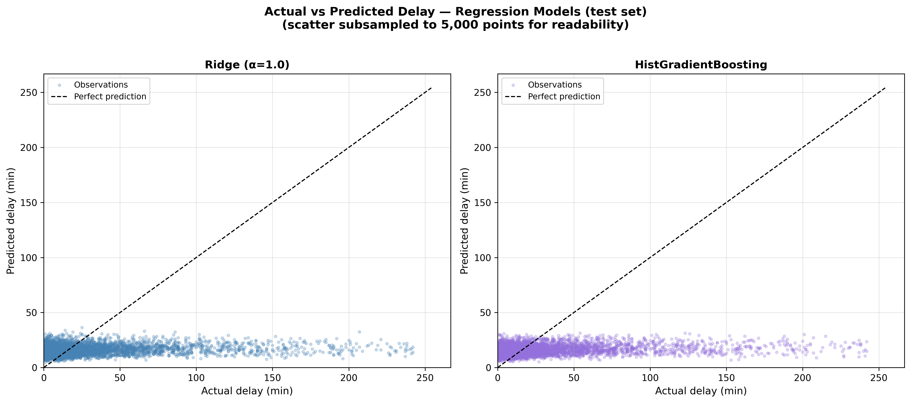
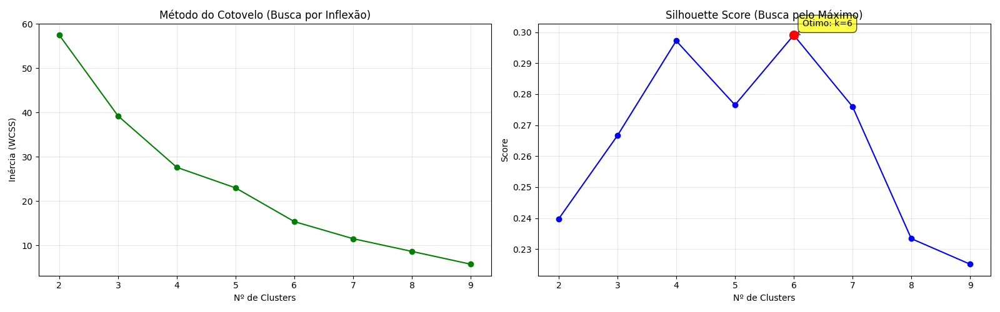
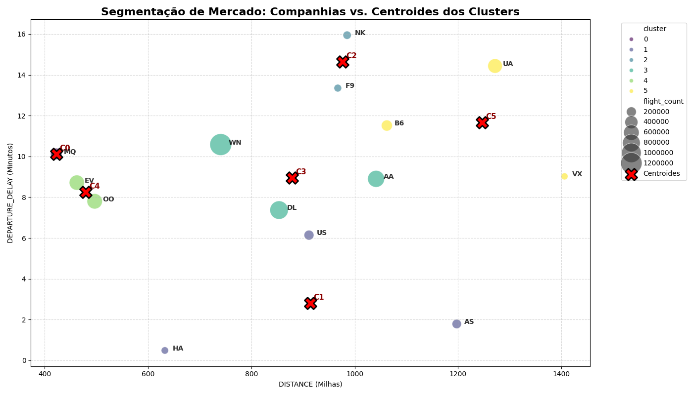
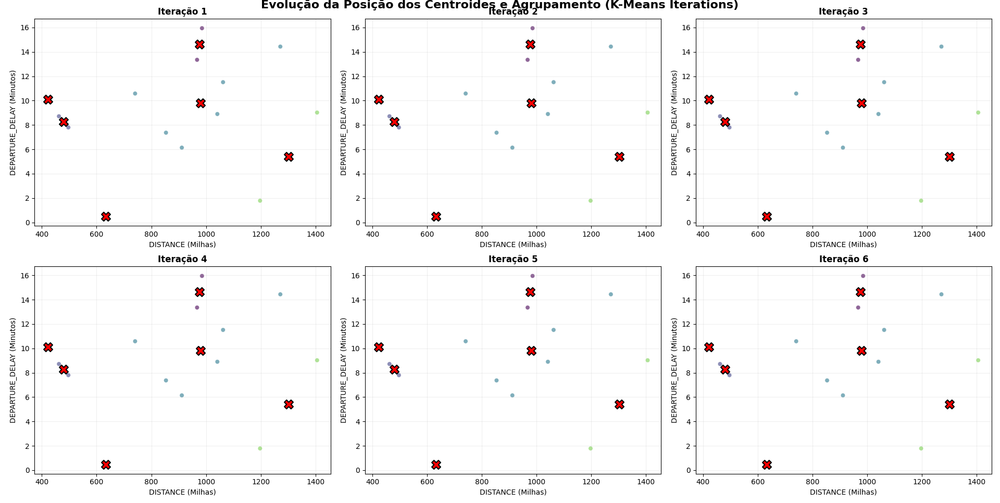

# Flight Data Analyzer

A Python project for end-to-end machine learning analysis of US domestic flight data (2015), covering exploratory data analysis, supervised learning (classification and regression), and unsupervised clustering.

## Project Structure

```
flight-data-analyzer/
├── database/                        # Raw data files (downloaded from Google Drive)
│   ├── airlines.csv
│   ├── airports.csv
│   └── flights.csv
├── scripts/                         # Analysis and ML scripts
│   ├── download_data.py             # Download data from Google Drive
│   ├── eda.py                       # Exploratory data analysis
│   ├── exploratory_analysis.py      # Extended statistical exploration
│   ├── statistical_analysis.py      # Statistical tests and clustering utilities
│   ├── data_processing.py           # Data loading and aggregation helpers
│   ├── config.py                    # Constants, paths and feature lists
│   ├── models.py                    # Classification pipeline (SGD + HGB)
│   ├── train_model.py               # Classification training orchestrator
│   ├── regression_processing.py     # Data loading, cleaning and feature engineering for regression
│   ├── regression_models.py         # Regression pipelines (Ridge + HGB), evaluation and plots
│   ├── train_regression.py          # Regression training orchestrator
│   ├── clustering_pipeline.py       # K-Means clustering orchestrator
│   ├── pca_analysis.py              # PCA dimensionality reduction
│   └── __pycache__/
├── venv/                            # Virtual environment (not tracked)
├── visualizations/                  # Generated output plots (auto-created on run)
│   ├── flight_eda.png
│   ├── model_performance.png
│   ├── feature_importance.png
│   ├── regression_performance.png
│   ├── clustering_elbow_silhouette.png
│   ├── clustering_market_segmentation.png
│   ├── clustering_heatmap.png
│   └── clustering_inertia_curve.png
├── requirements.txt                 # Project dependencies
├── .gitignore                       # Git ignore rules
└── README.md                        # This file
```

## Setup

### 1. Create and Activate Virtual Environment

```bash
python -m venv venv
source venv/bin/activate  # On Windows: venv\Scripts\activate
```

### 2. Install Dependencies

```bash
pip install -r requirements.txt
```

### 3. Download Data from Google Drive

> ⚠️ Data files are not included in the repository due to size limits. Download them before running any script.

```bash
python scripts/download_data.py
```

This downloads `airlines.csv`, `airports.csv`, and `flights.csv` to the `database/` folder.

**Dependencies:** `pandas`, `numpy`, `matplotlib`, `seaborn`, `scikit-learn >= 1.3.0`, `gdown`

---

## Usage

All scripts are run from the **project root** (`flight-data-analyzer/`).

### 1. Exploratory Data Analysis

```bash
python scripts/eda.py
```

Loads all three datasets, generates descriptive statistics, analyzes missing values, and saves `flight_eda.png` to `visualizations/`.

### 2. Classification — Predict IF a flight will be delayed

```bash
python scripts/train_model.py
```

Trains two classifiers (SGDClassifier and HistGradientBoostingClassifier) to predict whether a flight will arrive late. Saves confusion matrices, Precision-Recall curves, and feature importance plots to `visualizations/`.

### 3. Regression — Predict HOW LONG the delay will last

```bash
python scripts/train_regression.py
```

Trains Ridge Regression and HistGradientBoostingRegressor to predict arrival delay in minutes for flights that are already late. Applies `log1p` transformation to the target and caps outliers at the 99th percentile. Saves Actual vs Predicted scatter plots to `visualizations/`.

### 4. Clustering — Segment airlines by operational profile

```bash
python scripts/clustering_pipeline.py
```

Runs a full K-Means pipeline: optimizes `k` using Elbow Method and Silhouette Score, fits the final model with `k=6`, and saves market segmentation scatter, cluster heatmap, iteration evolution, and inertia curve plots to `visualizations/`.

---

## Data Description

### airlines.csv
| Column | Description |
|--------|-------------|
| IATA_CODE | Airline identifier |
| AIRLINE | Full airline name |

### airports.csv
| Column | Description |
|--------|-------------|
| IATA_CODE | Airport identifier |
| AIRPORT | Airport name |
| CITY, STATE, COUNTRY | Location |
| LATITUDE, LONGITUDE | Geographic coordinates |

### flights.csv (5.8M rows)
| Group | Columns |
|-------|---------|
| Date | YEAR, MONTH, DAY, DAY_OF_WEEK |
| Flight ID | AIRLINE, FLIGHT_NUMBER, TAIL_NUMBER |
| Route | ORIGIN_AIRPORT, DESTINATION_AIRPORT, DISTANCE |
| Schedule | SCHEDULED_DEPARTURE, SCHEDULED_ARRIVAL |
| Times | DEPARTURE_TIME, ARRIVAL_TIME, ELAPSED_TIME, AIR_TIME |
| Delays | DEPARTURE_DELAY, ARRIVAL_DELAY |
| Status | CANCELLED, DIVERTED |
| Delay causes | AIR_SYSTEM_DELAY, SECURITY_DELAY, AIRLINE_DELAY, LATE_AIRCRAFT_DELAY, WEATHER_DELAY |

---

## ML Pipeline Overview

### Classification

| Item | Detail |
|------|--------|
| Target | Binary: `ARRIVAL_DELAY > 15 min` |
| Models | SGDClassifier (threshold=0.4) vs HistGradientBoosting (threshold=0.6) |
| Best model | HistGradientBoosting — Average Precision = 0.335 |
| Baseline | Random classifier AP = 0.190 |

**Key insight:** HGB outperforms SGD by 23% and the random baseline by 76%.

### Regression

| Item | Detail |
|------|--------|
| Target | `log1p(ARRIVAL_DELAY)` — reverted with `expm1` at evaluation |
| Outlier handling | Cap at 99th percentile (~243 min) |
| Models | Ridge (α=1.0) vs HistGradientBoosting |
| Best model | HistGradientBoosting — MAE=0.92, R²=0.07 |

**Key insight:** Low R² is structurally expected — pre-flight features (route, schedule, airline) capture population-level delay patterns but cannot predict the root cause of individual delays (weather, ATC, cascade effects).

**Top features by permutation importance:**
1. `PERIOD_OF_DAY` (0.0629) — time of day dominates
2. `AIRLINE` (0.0467) — carrier has strong signal
3. `ORIGIN_AIRPORT` (0.0189) — origin matters more than destination

### Clustering (K-Means)

| Item | Detail |
|------|--------|
| Unit of analysis | Airline (14 data points, aggregated) |
| Features | DISTANCE, DEPARTURE_DELAY, ARRIVAL_DELAY, CANCELLED, AIR_TIME |
| k selection | Elbow Method + Silhouette Score → k=6 (score=0.300) |
| Convergence | 6 iterations |

**Cluster profiles:**

| Cluster | Profile | Airlines |
|---------|---------|----------|
| C0 | Short routes, high delay | MQ |
| C1 | Medium routes, low delay | US, DL |
| C2 | Medium routes, high delay | NK, F9 |
| C3 | Medium routes, moderate delay — highest volume | WN |
| C4 | Short routes, efficient | EV, OO |
| C5 | Long routes, elevated delay | UA, B6 |

---

## Key Findings

- **Late Aircraft is the dominant delay cause** — cascade delays from previous legs of the same aircraft are structurally unpredictable with pre-flight features alone.
- **Monday is the worst day** (avg 11 min departure delay); **Saturday is the best** (avg 8 min) — counterintuitive pattern that motivated the `IS_WEEKEND` feature.
- **Southwest (WN) operates the highest volume** (1.2M flights) but clusters separately from high-delay carriers.
- **United (UA) and JetBlue (B6)** form a distinct cluster: longest average routes (1,246 mi) with elevated delays.
- **Period of day matters more than day of week** for delay magnitude — morning flights delay less, evening flights cascade.

---

## Visualizations

### EDA


### Classification



### Regression


### Clustering




---

## Limitations and Next Steps

**Current limitations:**
- Pre-flight features have weak signal for delay magnitude — real causes (weather, ATC decisions, cascade) are unavailable at prediction time.
- K-Means assumes spherical clusters — airlines with mixed operational profiles may be misrepresented.
- Data is from 2015 only — patterns may not reflect post-pandemic aviation reality.

**Proposed improvements:**
- Integrate real-time weather data as input features.
- Model cascade delays using the previous leg's delay for the same aircraft.
- Apply SHAP for granular explainability of the HGB classifier.
- Test DBSCAN for non-spherical cluster shapes.
- Increase `SAMPLE_SIZE` and `max_iter` in HGB to explore R² gains.